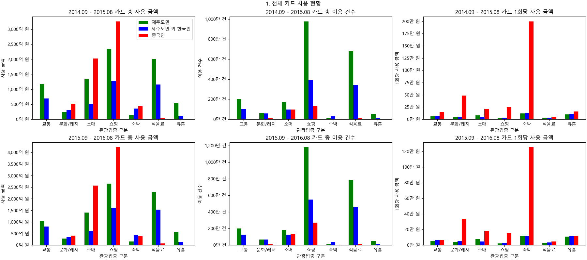
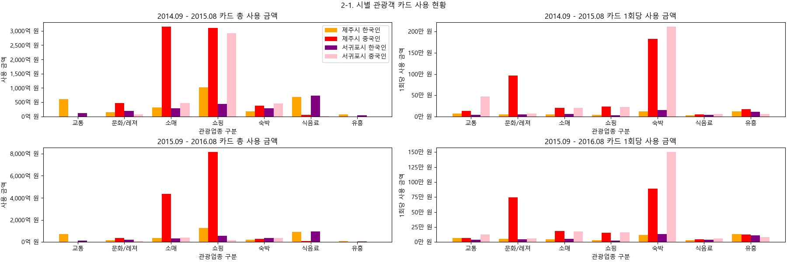
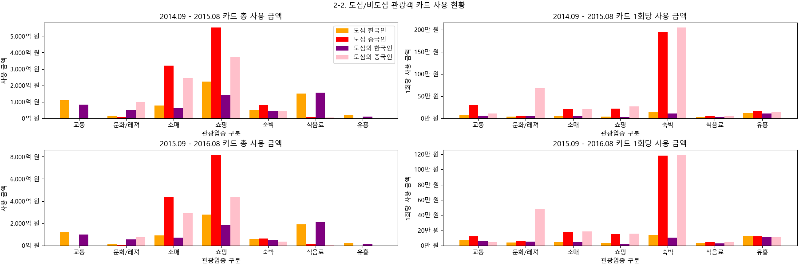
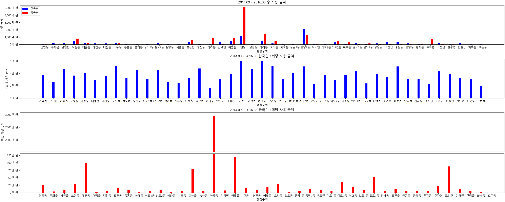
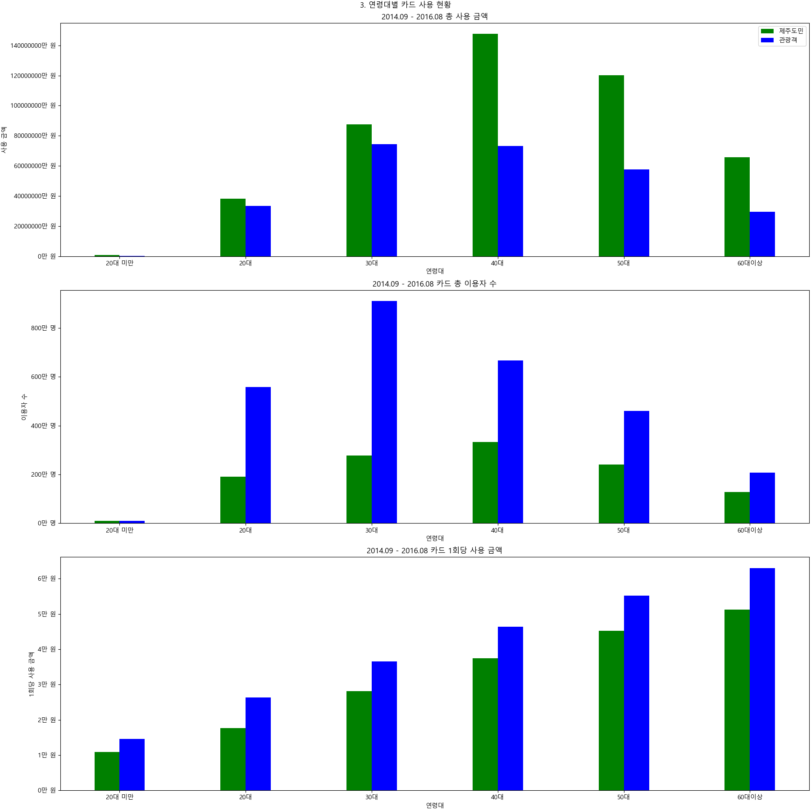
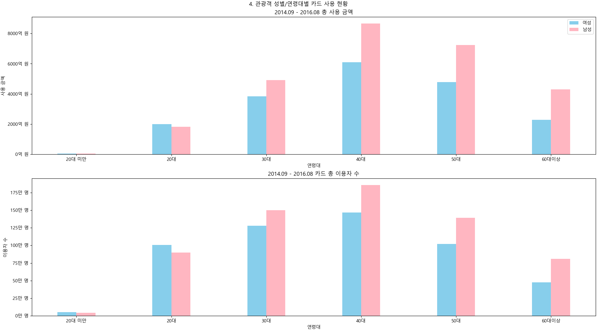

# 제주도 카드 사용 분석 미니 프로젝트

## 1. 프로젝트 배경, 목적

### 프로젝트 배경

- 최근 다양한 이유로 경기가 둔화됨 (2024년 12월 기준)
	- 자영업자 563만 6천 여명, 소비 19.7%가량 감소
	- 평균소비성향* 69.4%로 전년 동기 대비 하락; 7분기만에 70% 이하
- 대한민국은 GDP 대비 관광 산업 규모가 작은 나라
	- OECD 주요국 평균 10.4%
	- 2022년 2.8%, 51개국 중 최하위

이러한 어려움을 관광 산업의 활성화를 통해 해결할 수 있을 것이라 기대

### 프로젝트 목적

- 대한민국에서 가장 인기 있는 관광지 중 하나인 제주도에서의 카드 사용 정보를 바탕으로 소비 패턴을 알아보고자 함
- 분석한 자료를 통해 관광객들의 소비를 증가시킬 수 있는 방안을 알아보고자 함

## 2. 프로젝트 개요

### 프로젝트 작업 개요

- 기간: 6/20 - 6/23
- 프로젝트 인원: 1
- 시각화 요소 & 사용 툴: pandas, matplotlib

### 데이터 개요

- 보유 기관: 제주특별자치도
- 데이터: 2014~2016년도 제주 지역 내 내국인, 중국인 관광업종 BC카드 결제 데이터 
- 활용 항목: 내국인 및 중국인의 사용 금액, 이용자 수, 이용 건수, 성별, 연령대, 사용 지역, 거주 지역 등
- 비고: 2014.09 - 2016.08 자료로 2025년 현재 시점과는 약간의 차이가 있을 수 있음

## 3. 배경 설명

### 관광객

- 제주도 내 관광객 숫자: 2015년 13,664,395명
- 제주도 내 중국인 관광객 숫자: 2016년 1 - 11월 275만 명, 외국인 관광객 충 86%

참고자료: https://ombudsman.kotra.or.kr/jj-kr/bbs/i-1150/detail.do?ntt_sn=467316

### 소비

- 2015년 7월 기준 전체 소비액은 2383억(신한카드사 데이터 기준 가중치 부여)
- 이중 외국인 관광객의 비중은 19.06%

참고자료: https://data.ijto.or.kr/

### 배경

- 제주도 내 관광객 숫자는 2010년대 기준으로 매년 천만 명 이상
- 내/외국인 모두에게 인기 있는 관광지
- 최근 내국인 관광객은 감소하고 외국인 관광객은 증가하고 있음

참고자료: https://www.traveltimes.co.kr/news/articleView.html?idxno=410597

## 4. 분석

- 사용 금액
- 이용 건수
- 이용자 수
- 성별
- 거주지
- 연령대
- 국적

등의 자료를 사용하여 분석

### 1) 전체

- 제주도민/제주도민 외 한국인/중국인
- 관광영역 구분별 소비

### 2) 지역

- 제주시/서귀포시
- 도심/도심외
- 행정구역

### 3) 연령대

### 4) 성별과 연령대

## 5. 분석 결과

### 1) 전체

#### 카드 총 사용 금액

- 기간에 따른 차이는 뚜렷하지 않고 비슷한 추이를 보임
- 중국인 관광객 > 제주도민 > 한국인 관광객 순으로 사용량이 많음
- 쇼핑 > 소매 > 식음료 > 교통 > 문화/레저 >= 숙박 > 유흥 순의 사용량을 보임

#### 카드 총 이용 건수

- 제주도민 > 내국인 관광객 > 중국인 관광객 순으로 카드 이용 건수가 많음
- 쇼핑 > 식음료 > 소매 > 교통 > 문화/레저 > 유흥 > 숙박 순으로 이용 건수가 많음

#### 1회당 사용 금액

- 중국인 관광객 > 내국인 관광객 > 제주도민 순으로 1회당 사용 금액이 많음
- 숙박 > 문화/레저 > 소매 > 쇼핑 > 유흥 > 교통 > 식음료 순으로 1회당 사용 금액이 많음

### 2) 지역

#### 제주시/서귀포시

- 제주시는 교통, 쇼핑 분야에서, 서귀포시는 숙박 분야에서 타 시보다 카드 사용 금액이 높으며 나머지 항목에서는 뚜렷한 우위관계가 보이지 않음
- 중국인 관광객의 경우 소매와 문화/레저 업종에 서귀포시에서보다 제주시에서 더 많이 소비함
- 1회당 사용 금액은 중국인 관광객의 문화/레저를 제외하고는 시에 따라 큰 차이를 보이지 않고 비슷한 경향성을 보임

#### 도심/도심외

- 사용 규모와 1회당 사용 금액 모두 중국인 관광객이 압도적
- 교통과 문화/레저 항목에서의 중국인 관광객들의 소비 외에는 뚜렷한 차이점은 없음
- 중국인 관광객의 경우 도심에서 교통, 문화/레저의 경우 도심외에서 타 지역에서보다 많이 사용

#### 행정구역

- 한국인의 경우 용담2동, 조천읍, 중문동에서, 중국인의 경우 연동, 애월읍, 예래동, 아라동, 추자면에서 다른 집단보다 소비 규모가 큼
- 한국인의 경우 1회당 사용 규모는 행정구역에 관계 없이 2~6만원 사이로 비교적 균등
- 중국인의 경우 1회당 사용 규모가 한국인에 비해 매우 큰 편이고 대륜동, 성산읍, 애월읍에서 평균 50만 원 이상 소비, 아라동에서 평균 2000만원 이상 소비
	- 아라동에서의 상기 1회 소비 금액 평균은 쇼핑 항목에 의한 것

### 3) 연령대

- 제주도민은 40대, 관광객은 30대의 소비 규모가 가장 큼
- 제주도민과 관광객 모두 1회당 카드 사용 금액은 연령대와 정비례

### 4) 성별과 연령대

- 총 사용 금액은 이용자 수와 정비례
- 유일하게 20대 이하에서 여성의 이용자 수와 총 사용 금액이 남성보다 큼

## 6. 결론

### 1) 전체

1. 제주도민
- 제주도에 거주하므로 카드 이용 건수가 가장 많음
- 사용 금액 역시 비례해서 크지만 1회당 구매력은 뛰어나지 않음

2. 내국인 관광객
- 카드 이용 건수와 사용 금액의 규모가 둘 다 최하위
- 1회당 사용 금액도 제주도민과 유의미한 차이를 보이지 않음
- 세 집단 중 제주도의 수익에 미치는 영향이 가장 적음

3. 중국인 관광객
- 사용 금액 규모와 구매력이 모두 가장 큼
- 면세점 등의 영향으로 쇼핑과 소매 업종에 가장 많이 소비함
- 교통, 식음료, 유흥 업종에서의 사용 금액 규모는 가장 작지만 카드 1회당 사용 금액은 가장 큰 편으로 구매력은 가장 좋음

### 2) 지역

제주시/서귀포시 & 도심/도심외
예상보다 유의미한 차이를 보이지 않고 균등
차이를 보이는 지역들은 대체로 해당 관광업종이 밀집되어 있는 지역

행정구역
- 중국인 관광객들이 많이 찾는 지역은 중국인 관광객들의 소비 규모가, 한국인 관광객들이 많이
  찾는 지역은 한국인 관광객들의 소비 규모가 컸음
연동, 용담2동, 애월읍은 두 집단의 관광객들이 모두 많이 소비하는 행정구역
중국인 관광객의 경우 어느 지역에서든 1회당 사용 금액이 압도적으로 컸음

### 3) 연령대 & 성별

연령대
제주도민의 경우 사용 금액 규모는 4-50대가 가장 큼
관광객의 경우 3-50대의 사용 금액 규모가 엇비슷함
연령대가 높아질수록 1회 사용 액수가 커지는 경향이 있고, 구매력 역시 비례함

연령대 & 성별
성별에 따른 유의미한 소비 액수 차이는 보이지 않고 대체로 이용자 수에 비례해 사용 금액 
규모가 달라짐
20대 이하 집단에서만 여성의 사용 금액 규모와 이용자 수가 남성보다 컸음